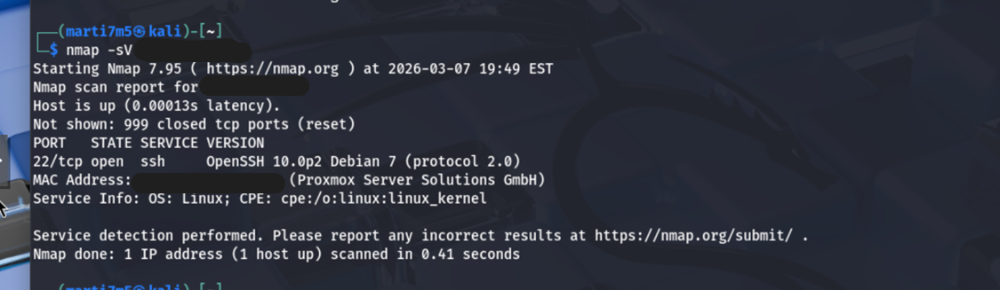

# Network Penetration Testing Lab
Hands-on network penetration testing lab simulating real-world internal security assessment with Nmap, Nikto, and Gobuster.

## Objective
Perform a simulated internal network penetration test to identify attack surfaces, analyze security weaknesses, and demonstrate how an attacker could gain initial access and move within the environment.

The following tools were used to simulate common attacker reconnaissance and enumeration techniques:
## Tools Used
- Nmap
- Nikto
- Gobuster
- Netcat

## Methodology
The assessment followed a structured reconnaissance and enumeration workflow designed to simulate real-world attacker behavior:
1. Network Discovery
2. Port Scanning
3. Service Enumeration
4. Vulnerability Scanning
5. Directory Enumeration
6. Manual Validation

## Key Findings
- Open ports and exposed services
- Missing HTTP security headers
- Accessible file shares
- Service version disclosure

## Risk Analysis

The identified risks highlight how common configuration weaknesses can be leveraged by attackers during the early stages of an intrusion.
### 1. Exposed SSH Service (Port 22)

**Risk:** The SSH service is exposed within the internal environment and may allow unauthorized access if weak credentials or outdated configurations are present.

**Impact:** An attacker could perform brute-force attacks or exploit vulnerabilities to gain initial access to the system, potentially leading to full system compromise.

**Likelihood:** Moderate. SSH is a common attack target, and automated tools frequently scan for exposed services.

---

### 2. Missing HTTP Security Headers

**Risk:** The web server does not implement key security headers such as X-Frame-Options and Content-Security-Policy.

**Impact:** This could allow attacks such as clickjacking or cross-site scripting (XSS), potentially compromising user sessions or sensitive data.

**Likelihood:** High. Misconfigured headers are common and easily exploitable.

---

### 3. Service Version Disclosure

**Risk:** The server reveals software version information (e.g., nginx version), which can be used by attackers to identify known vulnerabilities.

**Impact:** Attackers can target specific exploits associated with the disclosed version, increasing the likelihood of successful compromise.

**Likelihood:** High. Automated scanners actively look for version disclosures.

---

### 4. Accessible File Shares (SMB/NFS)

**Risk:** File-sharing services are accessible and may allow unauthorized users to read or modify sensitive data.

**Impact:** Could lead to data leakage, credential exposure, or lateral movement within the network.

**Likelihood:** Moderate to High depending on access controls.

## MITRE ATT&CK Mapping

The following MITRE ATT&CK techniques were observed or simulated during the assessment to reflect realistic adversary behavior:
### T1046 – Network Service Discovery
- Used Nmap to identify active hosts and open ports within the network.

### T1082 – System Information Discovery
- Service enumeration revealed system details such as running services and configurations.

### T1595 – Active Scanning
- Conducted automated scanning to identify vulnerabilities and exposed services.

### T1190 – Exploit Public-Facing Application
- Web server testing (Nikto, Gobuster) identified potential vulnerabilities in exposed web applications.

### T1083 – File and Directory Discovery
- Gobuster was used to enumerate hidden directories and files on the web server.

### T1021 – Remote Services
- SSH and SMB services could be leveraged for remote access if credentials are compromised.

These techniques align with early-stage adversary activity, particularly reconnaissance, discovery, and initial access, which are critical phases in real-world cyber attacks.

## Remediation Recommendations
- Implement regular patch management to address known vulnerabilities
- Harden exposed services by restricting access and disabling unnecessary features
- Apply network segmentation to limit attacker movement within the environment
- Restrict SSH access to authorized hosts or administrators only

## Attack Path Summary

An attacker could begin by performing network scanning to identify active hosts and exposed services. Once services such as SSH and web servers are discovered, enumeration techniques can reveal system details and potential vulnerabilities. If weaknesses are present, the attacker could attempt credential-based access or exploit web application flaws, leading to initial system compromise and potential lateral movement within the network.

## Key Takeaway

This assessment demonstrates how relatively minor misconfigurations and exposed services can be combined into a viable attack path. While each issue alone may appear low risk, together they significantly increase the likelihood of initial access and further exploitation within the environment.

## Sample Scan Output

_*Figure: Nmap service enumeration identifying an exposed SSH service and system details.*_
